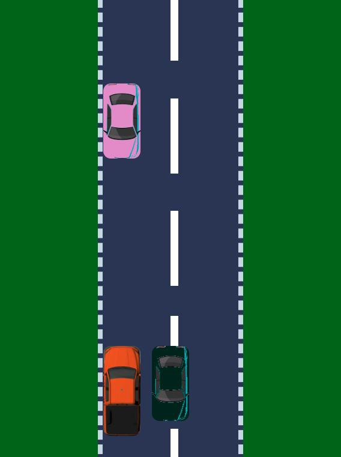
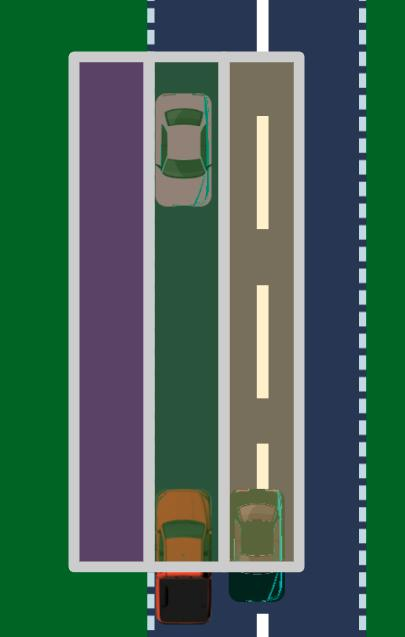

Inove Escuela de Código\
info@inove.com.ar\
Web: [Inove](http://inove.com.ar)

# ¡Proyecto Car IoT! [Python]
Este repositorio contiene todos los materiales e instrucciones para poder realizar el proyecto de Car IoT de programador python.

Este proyecto se acerca al tipo de trabajo y de desafios que tendrán en el curso de Python IoT.

Para este proyecto ya cuenta con toda la parte del simulador de datos y sensores IoT, cómo también así la interfaz. Su deber será crear el sistema de manipulación de esos datos de los sensores para manejar el auto que se ve en el simuladorde la interfaz y evitar que choque/colisione.

__NOTA__: Recomendamos haber realizado todos los ejercicios de pŕactica para poder realizar este proyecto, principalmente los de:
- JSON y ETL
- APIs

## Objetivo
El objetivo es manejar un auto en un simulador y evitar que el auto coche con otros, esquivando los obstáculos utilizando los sensores de proximidad del vehículo. Su sistema deberá:
- Conectarse a la API del backend del simulador de conducción del vehículo para obtener los datos de los sensores.
- Realizar una API POST al backend para mover el vehículo en función de los datos recibidos de los sensores.

Para lograr esto, deberá lanzar el backend del simulador de conducción y luego lanzar su programa que se conectará a este.



## Recursos
- Contará con todos los archivos necesarios del simulador en la carpeta del proyecto (el archivo app.py para lanzar el simulador)

Una vez que haya lanzado el backend del simulador en app.py, podrá acceder al frontend en:
```
http://127.0.0.1:5000
```

## El simulador
El simulador está formado por dos grnades partes:
- Los sensores de proximidad, que será información que nos proveerá el backend del simulador.
- Los métodos de control para mover el vehículo y evitar que este colisione con otros (nuestra labor)

### Sensores de proximidad
Estos datos serán provistos cuando haga el HTTP Post al backend (se detallará más adelante como). Lo importante es que recibirá un JSON como:
```python
{
    "collide_level": {"top": 0, "left":0, "right":0},
    "frecuencia": 10
}
```

Lo importante aquí es "collide_level" (hablaremos más adelante de "frecuencia"). Dentro de "collide_level" tenemos los datos de tres sensores:
- top -> el sensor que mide la proximidad de vehículos que vienen de frente a nuestro vehículo.
- left -> el sensor que mide la proximidad de vehículos que vienen por la izquierda a nuestro vehículo.
- right -> el sensor que mide la proximidad de vehículos que vienen por la derecha a nuestro vehículo.



¿Cómo funcionan los sensores?
- Si el sensor notifica "0", quiere decir que no hay ningún vehículo a la vista en ese espacio.
- Si el valor es 1 o más, quiere decir que hay un vehículo a la vista. Cuanto más alto es el valor quire decir que más lejos está el vehículo del nuestro.
- Si el valor es 1, significa que hay una colisión inminente en ese sentido. 
    - Si top=1 quiere decir que hay un auto que viene de frente muy cerca al nuestro (una colisión frontal inminente)
    - Si left=1 quiere decir que hay un auto que está pasando por la izquierda muy cerca al nuestro. Si nuestro auto en ese momento se mueve a la izquierda chocaría contra este.
    - Si right=1 quiere decir que hay un auto que está pasando por la derecha muy cerca al nuestro. Si nuestro auto en ese momento se mueve a la derecha chocaría contra este.

En base a estos valores deberá usted decidir como mover el vehículo.

### Control del vehículo
Estos datos se utilizarán para mover el vehículo, el JSON que deberá usted manipular tiene esta estructura:
```python
{
    "moveleft": 0,
    "moveright": 0,
}
```

- moveleft --> Si usted coloca este valor en 1, el vehículo se moverá a la izquierda (hasta que usted lo vuelva a colocar en 0).
- moveright --> Si usted coloca este valor en 1, el vehículo se moverá a la derecha (hasta que usted lo vuelva a colocar en 0).

Si deseamos que el vehículo no se mueva ni a izquierda ni a derecha (si solo deseamos que avance), deberemos dejar ambos valores en 0. Solo deberemos dejar uno de esos valores en 1 cuando deseamos que el auto se desplace a la izquierda o derecha.

## Como comenzar
- Deberá crear un archivo "controlador.py" en el cual colocará todo el código necesario para realizar el controlador del vehículo.
- Luego deberá crear el bloque principal `if __name__ == "__main__":`. Dentro del bloque principal utilizará sus funciones que desarrollará en el proyecto.
- Entre el lugar donde usted importó las librerías y generó el bloque pincipal, ahí irá creando sus funciones.
- En su archivo deberá importar las librerías que utilizará, en este caso necesitará importar las siguientes librerías:
    - requests
    - time

## El bloque principal del programa
Dentro del bloque principal del programa deberá declarar variable "url" para utilizar en su programa:
```python
    url = "http://127.0.0.1:5000/controller"
```

También deberá declarar ni bien comienza el bloque principal del programa la variable que utilizará para controlar el vehículo, inicializando todo en cero (sin movimiento):
```python
    controller_data = {
        "moveleft": 0,
        "moveright": 0,
    }
```

A continuación deberá declarar dentro del bloque principal del progrma el bucle While infinito de su programa que realice la siguiente actividad:
```python
    while True:
        gui_data = extract(url, controller_data)
        if gui_data is not None:
            controller_data = transform(gui_data, controller_data)
            frecuencia = gui_data["frecuencia"]
            time.sleep(1/frecuencia)
```

Ahora procederemos a explicar las funciones que deberá crear para que funcione ese bucle While infinito.

## Funciones del sistema
Dentro del archivo __controllador.py__ deberá implementar las siguientes funciones que utilizará luego el bloque main para armar el proyecto:

### Funcion "extract"
Encabezado de la función:
```python
def extract(url, controller_data):
```

Entrada (argumentos):
Esta función recibe por parámetro:
- La "url" a la cual el sistema deberá realizar el HTTP POST para obtener los datos de los sensors del simulador.
- Los datos de su controlador (los movimientos del vehículo).

Objetivo:
- La función deberá realizar un POST a la url pasada por parámetro.
- Los datos del controlador están en formato JSON, por lo que deben pasarse al método POST mediante el parámetro de la función json (consultar la documentación de requests POST):
```python
(..., json=controller_data)
```
- Si el POST no puede realizarse o si la peticción HTTP POST no se realizó con éxito, deberá retornar inmediatamente "None" (use try & except para evitar que su programa explote si no puede realizarse el POST).
- Si el POST pudo realizarse con éxito, esta función deberá retornar la respuesta del POST en json (utilice el método json() de requests).

Salida (return):
- La función deberá retornar el JSON retornado por el POST, o "None" si no pudo realizarse el POST.


### Funcion "transform"
Encabezado de la función:
```python
def transform(gui_data, controller_data):
```

Entrada (argumentos):
- Esta función recibe los datos de los sensores recibidos del simulador en "gui_data".
- Los datos de su controlador (los movimientos del vehículo) que deberá manipular en "controller_data".

Objetivo:
- La función deberá manipular los datos de controller_data en función de los datos que obtuvo de los sensores de proximidad del simulador en el JSON gui_data.
- Usted deberá desarrollar el algortimo que determine si el vehículo se debe mover a izquierda, derecha o no moverse para evitar colisionar con otro vehículo, utilizando los datos de los sensores.
- Una vez modifica la variable controller_data, su función deberá retornarla.


Salida (return):
- La función deberá retornar controller_data que usted ha modificado.


## Velocidad del simulador
Si desea disminuir la velocidad del simulador porque la PC no puede ofrecer los recursos necesarios para ejecutar el sistema en óptimas condiciones, debe ingresar al archivo app.py y reducir el valor de "frecuencia" y volver a lanzar todo (el backend, el frontend, su sistema).

Mismo, si desea aumentar la velocidad del simulador puede aumentar el valor de "frecuencia" (consumirá más recursos de su computadora para lograrlo).